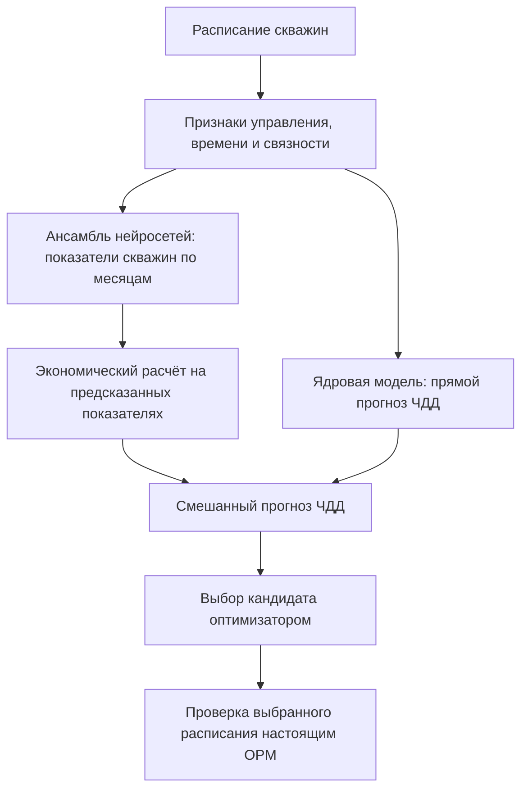

# Аудит реализации суррогата

Дословный итоговый ответ из диалога. Различать код, исполненные проверки, старый локальный checkpoint и заявленный production-релиз. [Детали и границы проверки](06-evidence-and-tests.md).

Да, братец. Код изучил. **У вас реализован содержательный гибридный суррогат для фиксированного Model_Z. Главная слабость сейчас — надёжность выбора улучшений на новых ограничениях и стыковка суррогата с агентной политикой.**

Прошёл построение признаков, нейросети, экономическую модель, обучение, проверки и поиск. **209 тестов прошли**, дополнительно воспроизвёл два расхождения с заявленным поведением. Текущего production-пакета локально нет, поэтому состав релизных весов и опубликованные метрики отделяю от того, что проверил исполнением.

**1. Как устроено само решение**

У одного расписания два пути оценки:



Смешивание действительно реализовано в [predict_economics](/Users/kaifarikman/hackathons/aios-hack/aios/backend/application/optimization/schedule_search.py:1191). В описанном релизе:

`прогноз ЧДД = 80% прямой модели + 20% экономики предсказанных траекторий`

То есть основную долю итогового числа даёт **отдельная регрессионная модель ЧДД**. Это существенная деталь для объяснения решения жюри.

**2. Что именно предсказывают нейросети**

На вход поступают **103 скважины × 224 месяца = 23 072 строки**. Каждая строка описывает одну скважину на одном шаге:

- текущая уставка, роль, открытие/закрытие;
- накопленные *заданные* объёмы добычи и закачки;
- текущая и накопленная закачка соседей, взвешенная коэффициентами λ;
- время и количество событий;
- координаты устья и числовой идентификатор скважины.

Дополнительно сеть обучает 16-мерное представление каждой скважины. Архитектура — полносвязные слои с SiLU, LayerNorm и dropout; есть вариант с остаточными блоками. [Реализация сети](/Users/kaifarikman/hackathons/aios-hack/aios/backend/ml/surrogate/model.py:308).

На выходе шесть показателей: месячная масса нефти, объём жидкости, объём закачки, дебит жидкости, интенсивность закачки и забойное давление.

**Принципиальная особенность:** строки обрабатываются отдельно. В этом пути нет рекуррентного состояния пласта, передачи сообщений по графу или решения уравнений фильтрации. Память о прошлом представлена накоплениями, а взаимодействие скважин — агрегатами λ.

Для быстрого приближения знакомых режимов это разумная конструкция. Но она сжимает историю: разные последовательности управления могут давать похожие текущие признаки, хотя физическое состояние пласта различается.

В релизном описании указаны две обычные сети и одна residual-сеть, всего около 190 тысяч параметров. Загруженный мной **старый локальный checkpoint** действительно содержит сеть на 41 078 параметров; полный текущий ансамбль проверить по весам пока невозможно.

**3. Денежная модель — отдельная важная часть**

[BlockKernelNpvHead](/Users/kaifarikman/hackathons/aios-hack/aios/backend/ml/surrogate/npv_block_head.py:382) обучается методом ядровой регрессии: расписание превращается в большой вектор, затем сравнивается с обучающими сценариями. Коэффициенты находятся решением системы с регуляризацией.

Вектор содержит 4 406 признаков: общие статистики, временные агрегаты, признаки отдельных скважин и событий. По [релизному описанию](/Users/kaifarikman/hackathons/aios-hack/aios/SURROGATE_DEFENSE.md:106), действующая модель использует 833 обучающих центра; веса блоков — `(0, 0.7, 0.3, 0)`.

Значит, в этой версии активно работают временные и скважинные агрегаты. Само наличие блока экономических событий ещё не означает, что он влияет на прямой прогноз.

Мой вывод: **это хорошо объясняет возможность получать приличный итоговый ЧДД даже при несовершенных траекториях.** Но точность общего числа не доказывает точность каждого физического канала.

**4. Обучение сделано осмысленно, но production и эксперименты нужно различать**

В коде есть хорошие решения:

- разделение на целые сценарии до обучения, а не случайные строки одного прогона;
- оценка λ по обучающей части;
- нормализация признаков и целей;
- AdamW, ранняя остановка, сохранение лучшей эпохи;
- проверка соответствия меток расписаниям по хешам;
- отдельный ранговый режим, учитывающий порядок сценариев по ЧДД.

Особенно полезное исправление: ранговое обучение выбирает **одинаковые координаты скважин и месяцев** для сравниваемых сценариев. Иначе сравнение могло отражать случайный состав выбранных скважин.

Однако по описанию релиза у действующих нейросетей **`ranking_loss_weight=0`**, параметризация — `absolute`. Ранговое дообучение и вариант через обводнённость существуют в коде, но это не делает их свойствами текущих весов.

Поэтому на защите нельзя объединять в один рассказ «что умеет тренер», «что проверяли в эксперименте» и «что реально запущено».

**5. Самый важный системный вывод: успешный эксперимент получен резервным поиском**

Основной путь — CMA-ES подбирает **10 параметров правил управления**. Правила строят расписание, суррогат даёт отклик, правила пересчитывают решения. Цель внутреннего цикла — получить устойчивое расписание.

Но если допустимых финалистов нет, включается [_search_near_baseline](/Users/kaifarikman/hackathons/aios-hack/aios/backend/application/optimization/search_run.py:219): берётся база и проверяются небольшие изменения отдельных скважин — ±1 м³/сут добычи, ±5 м³/сут закачки.

В описанном успешном прогоне основной поиск отклонил 10 вариантов, резервный нашёл 10 допустимых. Именно оттуда получен результат, затем проверенный OPM. [Протокол](/Users/kaifarikman/hackathons/aios-hack/aios/SURROGATE_DEFENSE.md:365).

**Это подтверждает работоспособность цепочки поиска и проверки. Сходимость и пользу основной агентной политики этот эксперимент не подтверждает.** В коде резервный путь честно сохраняет `policy_equilibrium=not-claimed`.

Ещё деталь: ансамбль усредняет прогнозы, но не отдаёт их разброс как неопределённость. В изученном пути нет отбора по формуле `ΔЧДД − β·σ`, которую обещает план.

**6. Нашёл конкретные ограничения в коде**

**Лаг связности не используется при построении входа суррогата.** Я взял тестовое расписание и изменил только `lag_months` с 0 на 6. Получилось:

```text
lag_0_vs_6_identical_input: True
```

В [признаках соседей](/Users/kaifarikman/hackathons/aios-hack/aios/backend/ml/surrogate/features.py:478) используются текущие уставки и накопления без сдвига на лаг. Поэтому утверждение «суррогат учитывает измеренную задержку через `lag_months`» сейчас неверно. Это не исключает косвенного обучения временным закономерностям, но явной проводки лага нет.

**Полный набор физических проверок не подключён к поиску.** Поиск вызывает `check_prediction`, который пропускает `INJECTION_RESPONSE` и `MATERIAL_BALANCE`: им нужна пара «опора–кандидат». Проверка допуска смотрит только на число нарушений, игнорируя неполноту отчёта.

Воспроизведение дало:

```text
physics_complete: False
physics_admissible: False
blocking: 0
production_physics_gate: accepted incomplete report
```

Это видно непосредственно в [вызове проверки](/Users/kaifarikman/hackathons/aios-hack/aios/backend/application/optimization/schedule_search.py:1216). Пройденные тесты не опровергают находку: они хорошо проверяют отдельные функции, но не устанавливают полноту проверки в рабочем пути.

При этом некоторые ограничения действительно встроены в декодер: отрицательные значения обрезаются, потоки закрытых скважин зануляются, нефть ограничивается объёмом жидкости. Это полезно, однако такой контроль не доказывает выполнение уравнений гидродинамики.

**Переносимость ограничена конкретным фондом.** Сеть требует совпадения оси скважин, имеет обученное представление каждого ID; размер блоков денежной модели фиксирован под 103 скважины. Признаки также привязаны к истории Model_Z. Добавление новых скважин потребует работы с моделью и артефактами — увеличение числа агентов само по себе этого не решает.

**7. Как я оцениваю качество решения**

Для исторических 105 test-сценариев опубликованы Spearman 0,860 и precision@5 0,80. Это обнадёживает именно для **составления короткого списка на проверку OPM**. Но там же указан regret@1 около **167 млн ₽**: выбор одного первого кандидата отличается от проверки нескольких лучших. Текущие цифры я не пересчитывал — отсутствует production-пакет.

На новом комбинированном кейсе ошибка полного ЧДД 0,1186%, а ошибка изменения ЧДД — 97,84%. Одного случая недостаточно для общего приговора модели, но он показывает, какую проверку вам сейчас недостаёт: **умеет ли модель выбирать полезные небольшие изменения вокруг допустимой базы**.

Я бы защищал решение такой формулировкой:

> Мы построили гибридный суррогат для Model_Z: ансамбль нейросетей прогнозирует показатели скважин, отдельная ядровая модель оценивает ЧДД. Суррогат ускоряет отбор вариантов внутри проверенной области; выбранное расписание подтверждается OPM. Основная незакрытая задача — устойчивое улучшение планов при новых ограничениях.

До чекпоинта я бы сосредоточился на трёх вещах: **воспроизвести точный production-релиз; проверить небольшой список близких кандидатов вместе с базой на одинаковом кейсе; привести заявления о физике и агентной политике в соответствие с реально выполняемым кодом.** Перестраивать нейросеть целиком сейчас оснований не вижу.

