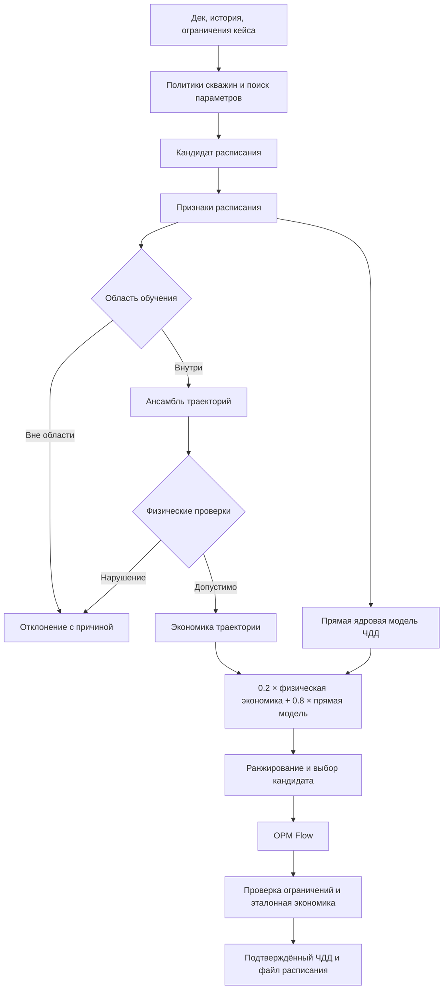

# Суррогатная модель AIOS: устройство, результаты и инструкция для защиты

Дата технического среза: **6 сентября 2026 года**. Документ описывает код в актуальной структуре `backend/`, рабочий ансамбль и отдельно экспериментальные изменения обучения. Числа разных моделей и выборок не смешиваются.

## 1. Что сказать за одну минуту

Мы оптимизируем режимы скважин Model Z по чистому дисконтированному доходу — ЧДД. Гидродинамический симулятор OPM даёт физический отклик, но запускать его для каждого кандидата дорого. Поэтому система сначала оценивает расписания суррогатом, проверяет область применимости и физическую согласованность, а перспективный допустимый план подтверждает настоящим OPM.

Рабочий суррогат состоит из трёх небольших нейросетей, предсказывающих траектории скважин, и отдельной ядровой модели ЧДД. Итоговый прогноз — 80% прямой экономической модели и 20% экономики предсказанной траектории. На 105 исторических test-сценариях этот бленд имеет Spearman 0.860 и precision@5 0.80. Это качество ранжирования знакомого распределения, а не гарантия точности на любом режиме.

Последний аудит исправил шум рангового обучения, рассогласование ввода скважин и отключённую проводку сценарного OOD. В ограниченном эксперименте комбинация общей выборки и фактических меток ЧДД повысила Spearman с 0.582 до 0.632 и precision@5 с 0 до 0.60. Эти экспериментальные веса не заменяют рабочий ансамбль: для их продвижения нужна независимая проверка полного прогноза.

## 2. Постановка задачи и границы

Объект — Model Z, 103 скважины, одна геологическая модель. Управление начинается 01.01.2007. Дек содержит 371 дату; управление — 225 дат и **224 наблюдаемых интервала**. Последняя управляющая дата не создаёт дополнительного месяца добычи.

Допустимые действия: менять отбор жидкости и закачку, открывать/закрывать скважины, переводить добывающие под закачку. Нельзя считать оптимальным план, который нарушает ограничения воды, оборудования, состояний фонда или физики. Геологические мероприятия не входят в эту постановку.

Источники требований — `../docs/TASK.md`, оригинальное ТЗ в материалах организаторов и эталонный `CHDD_PYTHON`. Исполняемые единицы и оси определены в [контрактах](backend/core/contracts/README.md). Исторические планы не заменяют текущие требования.

Цель суррогата — сократить число дорогих проверок и выбрать хороший короткий список. **Заявляемый на сдачу ЧДД должен быть рассчитан по OPM-отклику именно сдаваемого расписания.** Предсказанный доход и подтверждённый доход сохраняются раздельно.

## 3. Общая схема



В реализации есть дополнительные проверки статического расписания, сходимости политики и ограничений по фактическому отклику. Диаграмма показывает место суррогата, а не отменяет эти проверки.

## 4. Технологии и почему они выбраны

| Технология | Где используется | Практическая причина |
|---|---|---|
| Python, типизированные dataclass и Enum | Контракты, экономика, политики, оркестрация | Явные единицы и состояния; один расчёт используется обучением, проверкой и интерфейсом |
| PyTorch | Траекторные сети, ядровая голова, PCA/kNN-детектор | Автоматическое дифференцирование, тензорные операции, CPU-инференс, сериализация весов |
| NumPy | Массивы и диагностические операции | Обмен числовыми данными и воспроизводимые расчёты |
| scikit-learn | Исторические исследовательские сравнения регрессоров | Сопоставление с простыми моделями; не обязательная зависимость текущего инференса бленда |
| OPM Flow | Источник обучающих откликов и финальная гидродинамическая проверка | Открытый симулятор, работающий с подготовленным деком; независимая физическая проверка нейросети |
| openpyxl | Чтение нормативов из XLSX | Нормативы берутся из поставки организаторов, а не дублируются числами в модели |
| CMA-ES | Поиск параметров политики | Не требует градиента через дискретные решения, проверки и симулятор |
| React + TypeScript + Vite | Веб-интерфейс | Компонентные представления скважин и результатов, типизация обмена JSON, сборка статики |
| Docker и Docker Compose | Сборка и запуск | Код и зависимости отделены от внешних деков, весов и результатов |
| pytest, Vitest, Git, SHA-256 | Проверки и происхождение артефактов | Регрессии, история изменений, проверка идентичности расписаний и моделей |

Версии среды проведённых Python-экспериментов: Python 3.12, PyTorch 2.13.0, NumPy 2.5.2, scikit-learn 1.9.0, openpyxl 3.1.5. Для ML-части контейнера версии закреплены в [requirements-ml.txt](requirements-ml.txt). Фронтенд использует React 19, TypeScript 5.8 и Vite 6; точные разрешённые версии фиксируются lock-файлом.

Сама нейросеть мала, потому что независимых сценариев существенно меньше, чем строк «скважина × месяц». Миллионы коррелированных узлов не эквивалентны миллионам независимых экспериментов. Это инженерное обоснование компактной архитектуры, а не доказательство, что более сложная сеть никогда не поможет.

## 5. Что модель получает на вход

[ScheduleFeatureizer](backend/ml/surrogate/features.py) строит признаки из расписания и доступной истории. Фактический будущий отклик OPM кандидата на инференсе недоступен и в признаки не подставляется.

На узле используются:

- текущая уставка и эффективная целевая интенсивность;
- накопленные целевые объёмы жидкости и закачки;
- накопленная и текущая закачка соседей через доступную связность;
- число управляющих и фиксированных событий;
- статические признаки скважины и положение во времени;
- роль, доступность и состояние OPEN/SHUT;
- обучаемое вложение идентификатора скважины.

Полная базовая числовая/категориальная строка содержит 21 признак до добавления 16-мерного вложения скважины. Для ансамбля в production `scenario_context=False`. В пробном ранговом обучении использовался `scenario_context="mean"`: к узлам добавляется общая сводка сценария. Это разные конфигурации, их нельзя описывать как одну.

В рабочем поиске `lambda_edges` передаются пустыми; нельзя заявлять, что текущая нейросеть обязательно использует полный измеренный граф связности. Политика может использовать λ отдельно. Явного признака времени после последнего события и обучаемой модели лага в текущем суррогате нет. Геологические кубы и полная расчётная сетка непосредственно нейросети не подаются.

Числовые признаки преобразуются и стандартизуются статистиками train. Те же преобразования и оси применяются при инференсе. Общая выборка рангового батча дополнительно проверяет совпадение порядка скважин и шагов между сценариями.

## 6. Архитектура траекторного ансамбля

| Компонент | Устройство |
|---|---|
| MLP №1 | 41 078 параметров, ширина 128, 3 скрытых слоя |
| MLP №2 | 41 078 параметров, другая инициализация/seed |
| Residual-сеть | 107 382 параметра, остаточные блоки |
| Общий размер трёх сетей | 189 538 параметров |
| Внутренние операции | Linear, SiLU, LayerNorm, dropout 0.05 |
| Вложение скважины | 16 чисел |
| Веса усреднения | 0.25, 0.25, 0.50 |
| Обучение действующих весов | Smooth L1; `ranking_loss_weight=0` |
| Выход на сценарий | 103 × 224 = 23 072 узла, по 6 каналов |

Каналы: прирост массы нефти, прирост объёма жидкости, прирост объёма закачки, дебит жидкости, интенсивность закачки, забойное давление. Масса нефти измеряется в тоннах, объёмы — в м³, интенсивности — в м³/сут; давление интерпретируется по контракту и деку.

Production использует параметризацию `absolute`. Нефть предсказывается отдельным каналом; после декодирования ограничивается объёмом жидкости с учётом плотности. Для закрытых/невведённых скважин потоки зануляются, для добывающих зануляется закачка, для нагнетательных — добыча. Это ограничения декодера; они не означают, что сеть выучила уравнения фильтрации.

Инференс `main` сохранён при переносе исправлений: признаки ансамбля строятся один раз, проходы сети объединяются в крупные батчи, OOD общего домена не пересчитывается трижды. LayerNorm действует на строку, поэтому такое объединение не смешивает разные сценарии как BatchNorm.

Код: [model.py](backend/ml/surrogate/model.py), [ensemble.py](backend/ml/surrogate/ensemble.py), [adapter.py](backend/ml/surrogate/adapter.py).

## 7. Экономическая голова и полный прогноз

Прямая голова — `BlockKernelNpvHead`, блочная полиномиальная ядровая регрессия. Она сравнивает сценарий с обучающими центрами в пространстве агрегированных признаков расписания и прогнозирует ЧДД целиком.

Вектор имеет 4 406 координат: глобальные, временные, по отдельным скважинам и экономические события. Однако действующие веса блоков равны **(0.0, 0.7, 0.3, 0.0)**: реально взвешиваются временной и скважинный блоки. Нельзя говорить, что все четыре блока активно влияют на текущую голову. Режим ядра `joint`, ridge-регуляризация 0.3. В артефакте **833 обучающих центра**.

Происхождение центров отличается от датасета траекторий: исторические train+validation после удаления повторов и три раскрытые дополнительные серии по 80 расписаний; повтор baseline исключён. Это видно в `data/npv-v6/direct-refit-locked/lock_report.json`. Поэтому validation исторического датасета нельзя использовать как независимую оценку этой production-головы. В пробных траекторных обучениях ниже validation в fit не включалась.

Физическая компонента — расчёт настоящего экономического кода на предсказанных траекториях. Финальная формула прогноза:

```text
NPV_pred = 0.8 × NPV_direct + 0.2 × NPV_economics(predicted_trajectory)
```

У поиска и диагностического отчёта теперь один путь — `predict_economics`. Версия ансамбля, под который заморожен бленд, проверяется при загрузке. Нельзя незаметно подменить одну из трёх сетей или вес смешивания и продолжать ссылаться на старую валидацию.

Код: [npv_block_head.py](backend/ml/surrogate/npv_block_head.py), [npv_economic_features.py](backend/ml/surrogate/npv_economic_features.py), [schedule_search.py](backend/application/optimization/schedule_search.py).

## 8. Что именно мы обучали — и что сеть выучила

Обучение траекторий приближает отображение:

```text
расписание + фиксированная история → помесячный отклик каждой скважины
```

Вложение скважины и параметры сети позволяют учесть устойчивые различия между скважинами и закономерности реакции на изученные режимы. Ядровая голова учится связи агрегатов расписания с итоговым ЧДД на доступных центрах.

Ранговое дообучение дополнительно учит предпочтению: «у сценария A фактический ЧДД выше, чем у B». Оно не обучает отдельного агента с подкреплением и не запускает LLM. Политики, CMA-ES и языковой слой — отдельные части системы.

Нельзя заключать по этим метрикам, что модель восстановила причинную гидродинамическую связь, идентифицировала геологию или перенесётся на новое месторождение. Проверено качество предсказания и ранжирования на конкретных популяциях расписаний.

## 9. Данные и защита от утечки

Исторический набор: 700 записей расписаний, **698 уникальных**. Разбиение траекторной задачи — 490 train, 105 validation, 105 test; в train есть два повтора. Деление выполняется по целым расписаниям, а не отдельным месяцам.

Отклики получены настоящим OPM. Возмущённые управляющие планы являются спроектированными экспериментами; числовые целевые отклики не выдуманы. Синтетические фикстуры используются только для проверки формы и сериализации.

Точное соответствие метки проверяется тройкой `source_dataset`, `scenario_id`, `canonical_schedule_hash`. Тренер проверяет сплит, конечность ЧДД, hash датасета, provenance целевой величины и нормативы. Одинаковые canonical hash в train и validation запрещены. При уменьшении train через `scenario-fraction` одновременно выбираются тензоры, счётчики, идентичности и метки.

Исторический test уже многократно исследовался. Его актуальные цифры полезны как диагностический регрессионный ориентир, но повторное использование не превращает его в новый blind holdout. Для выбора следующих весов нужен заранее зафиксированный независимый набор.

## 10. Как устроено исправленное ранговое обучение

Раньше из каждого сценария независимо выбирались 4 096 узлов. В одном батче различались одновременно управление и состав выбранных скважин/месяцев. Большая разница между сильными и слабыми узлами могла перекрывать небольшой эффект управления и переворачивать правильный порядок сценариев.

Теперь в батче для всех сценариев выбираются **одинаковые координаты скважина/шаг**. Это уменьшает шум состава. Само по себе отсутствие смещения суммы не гарантирует правильного ранга — это и было ошибкой прежнего обоснования.

Функция потерь объединяет ошибку траекторий и попарный ранговый член. В режиме `exact-npv` порядок задают полные фактические метки ЧДД сценариев, а не случайная сумма денежных прокси выбранных узлов. Лучшая эпоха также выбирается по рангу относительно фактического ЧДД validation.

Прокси всё ещё является упрощением: он не дифференцирует весь автомат расчёта ЭЦН, событий и годовых налогов. Точные метки исправляют порядок целей, но не делают весь экономический расчёт дифференцируемым и не гарантируют корректность каждой траектории.

Средние ранги при равных прогнозах теперь учитываются корректно. Для константного предсказания диагностическая реализация возвращает 0, а не искусственно высокий Spearman от порядка строк.

## 11. Метрики: что означает каждое число

| Метрика | Смысл | Зачем нужна |
|---|---|---|
| Spearman | Корреляция порядков сценариев | Правильно ли модель ранжирует весь набор |
| precision@5 | Доля истинного top-5 внутри предсказанного top-5 | Хорош ли короткий список для OPM |
| regret@k | Истинный максимум ЧДД минус лучший истинный ЧДД среди первых k прогнозов | Цена ошибки отбора в рублях |
| MAE | Средняя абсолютная ошибка ЧДД | Насколько ошибается абсолютная величина |
| Медианная относительная ошибка | Типичная ошибка в процентах от фактического ЧДД | Масштаб ошибки без доминирования выбросов |
| P95 относительной ошибки | Верхняя часть распределения ошибок | Поведение на сложных сценариях |
| Физические флаги | Нарушения допустимости отклика | Можно ли вообще доверять траектории |
| OOD | Удалённость входа от обучающей области | Нужно ли воздержаться от экстраполяции |

При ЧДД около нуля относительная ошибка неустойчива; тогда особенно важны абсолютная ошибка и regret. Spearman 0.86 не означает «86% точности».

### 11.1. Действующая модель: исторический test, 105 сценариев

| Компонента | Spearman | precision@5 | MAE, млн ₽ | P95 относительной ошибки |
|---|---:|---:|---:|---:|
| Прямая голова | 0.8296 | 0.60 | 43.87 | 1.020% |
| Экономика траектории | 0.8261 | 0.60 | 83.33 | 2.616% |
| Полный бленд 80/20 | **0.8602** | **0.80** | **42.61** | **1.077%** |

Для бленда медианная относительная ошибка — 0.2198%; истинный лучший на втором месте; regret@1 — 167.34 млн ₽, regret@3 и regret@5 — 0 на этой выборке.

Ранее число 0.8296 описывало прямую голову. Переход к отчёту 0.8602 — **исправление того, что измеряется**, а не прирост от нового обучения. Улучшение ранга не обязано сопровождаться улучшением каждого квантиля ошибки: у бленда P95 немного хуже прямой головы.

### 11.2. Пробные обучения 06.09: validation, 105 сценариев

Условия одинаковы: seed 20260817, 60 эпох, 245 train-сценариев, width 128, 3 слоя, ranking weight 3, CPU, mean-контекст. Оценивается денежный прокси траекторной модели против одинаковых фактических меток OPM, **не production-бленд**.

| Обучение | Spearman | precision@5 | regret@1, млн ₽ | regret@5, млн ₽ |
|---|---:|---:|---:|---:|
| Независимая выборка + proxy | 0.5821 | 0.00 | 184.08 | 110.34 |
| Общая выборка + proxy | 0.5945 | 0.00 | 197.47 | 110.34 |
| Общая выборка + exact NPV | **0.6318** | **0.60** | **71.76** | **53.05** |

Общая выборка отдельно дала небольшой прирост Spearman, но не улучшила top-5 и ухудшила regret@1. Основной выигрыш этого опыта получен комбинацией с точными метками и выбором эпохи по фактическому ЧДД. Один seed и половина train не доказывают устойчивость эффекта. Эти модели сохранены как исследовательские кандидаты.

Отдельная диагностика целевого сигнала на train показала: доля перевёрнутых пар относительно полного прокси снизилась с 33–35% до 7–9%. Это измерение шума выборки, а не метрика обученной нейросети.

### 11.3. Новый режим и ограничения переносимости

На восьми изученных сценариях режима ограниченной воды медианная ошибка абсолютного ЧДД достигала **431.02%**. Высокий ранг на восьми точках не спасает неверный масштаб и не доказывает качество соседних кандидатов.

Сценарный PCA/kNN-детектор даёт для двух проверенных примеров 86.9171 и 119.902 при пороге 11.4167; production теперь отклоняет эти входы. OOD не улучшает прогноз на них — он предотвращает использование неподтверждённого прогноза.

В репозитории есть отдельная локальная калибровка водного семейства с собственной версией головы и OPM-якорями. Она не переносится автоматически на текущий бленд. Положительная аффинная калибровка меняет масштаб, но сохраняет порядок; она не заменяет обучение ранжированию и не должна отключать OOD.

## 12. Физика и область применимости

Сценарный детектор стандартизует признаки, проецирует их в PCA-пространство и сравнивает с обучающими соседями. Порог выбран по validation-квантилю 0.95. Он дополняет покомпонентный контроль диапазонов: каждый признак отдельно может оставаться в своём диапазоне, хотя совместная комбинация уже новая.

Production manifest связывает модель, голову, контекст признаков и детектор. Проверяются контрольные суммы, dataset hash, версии и привязка бленда. Отсутствующий детектор в production-поиске — ошибка, а не разрешение продолжить без защиты.

Физические проверки находятся в [physics_checks.py](backend/ml/surrogate/physics_checks.py). Блокирующие нарушения останавливают оценку кандидата; предупреждения BHP требуют рассмотрения в OPM. Некоторые дифференциальные проверки требуют сопоставимой пары сценариев и могут быть пропущены с причиной — это не успешное прохождение проверки.

Фиксированные `WCONPROD/WCONINJE` теперь одинаково трактуются загрузчиком и признаками. На проверенном baseline устранены 22 расхождения активности и 58 ложных `SHUT_WELL_FLOW`. Гейт больше не вычитает количество нарушений базового сценария: равное число флагов могло скрывать новые нарушения на других скважинах.

## 13. Экономика — отдельный детерминированный расчёт

ЧДД считается из денежных потоков, с дисконтированием по году. В реализации:

```text
FCF = EBITDA − налог на прибыль − CAPEX ЭЦН
NPV = сумма FCF × discount_factor
```

Налог на прибыль считается на годовой базе. Первичное оснащение ЭЦН не начисляется как новая замена. События считаются по фактическим состояниям отклика, поэтому намерение «перевести скважину» и наблюдаемые последовательные состояния могут давать разные статьи затрат. Строки с отрицательными приростами обрабатываются по правилу эталонного расчётчика.

Нормативы читаются из XLSX организаторов. Подтверждением корректности служат тесты сопоставления с `CHDD_PYTHON`, а не совпадение нейросети с самой собой. Исторический test по ЧДД и тест соответствия эталонной экономике отвечают на разные вопросы.

## 14. Как пользоваться

### Установка

```bash
python3.12 -m venv .venv
.venv/bin/pip install -e '.[dev,ml]'
.venv/bin/pip install -r requirements-ml.txt
export AIOS_DOCS_ROOT=/absolute/path/to/docs-with-Model_Z
```

Нужны внешние данные: дек Model Z, нормативы `CHDD_PYTHON`, базовый отклик, λ и production-артефакты. Они не восстанавливаются одним `git clone`. Передача весов выполняется отдельным release-пакетом; обучающий датасет существенно больше и для инференса не нужен.

### Проверка установленного production

```bash
.venv/bin/python -m backend.presentation.cli.surrogate_check \
  --manifest data/surrogate-production.json \
  --output out/surrogate-runtime.json
```

Команда загружает реальные веса, проверяет привязки, выполняет прогноз baseline и физические проверки. `status=ready` означает готовность этого пути инференса; `opm_executed=false` и `verified_submission=false` прямо указывают, что новый результат сдачи не был подтверждён симулятором.

### Поиск и подтверждение

```bash
export AIOS_SURROGATE_MANIFEST="$PWD/data/surrogate-production.json"
.venv/bin/python -m backend.presentation.cli.run search --run-id defence-search
.venv/bin/python -m backend.presentation.cli.run verify --run-id defence-search
```

`full` выполняет оба этапа. Перед поиском нужно задать ограничения кейса и пути данных; доступность OPM и достаточный вычислительный бюджет обязательны для `verify/full`. Выход за область модели требует новых данных/проверки, а не увеличения допустимого OOD ради получения красивого числа.

Результаты находятся в `out/runs/<run-id>/`: manifest, точное расписание, прогноз, валидация, OPM и экономика. Сдавать можно только результат со статусом и доказательствами пройденной проверки, а не произвольный максимум прогнозов.

### Воспроизведение отчёта и нового обучения

```bash
.venv/bin/python -m backend.presentation.cli.surrogate_tools.surrogate_metrics_report \
  --output out/metrics-full-pipeline.json

.venv/bin/python -m backend.presentation.cli.surrogate_tools.surrogate_train_tensors \
  --mode rank --device cpu --threads 2 --epochs 60 --patience 60 \
  --scenario-fraction 0.5 --seed 20260817 --ranking-target exact-npv \
  --tensors data/lean700/tensors_context_490_canonical.pt \
  --npv-labels data/npv-v4/historical_labels_rebuilt.json \
  --normatives /absolute/path/to/Нормативы_ЧДД.xlsx \
  --output-dir data/new-ranked-candidate
```

Каталог нового кандидата не должен содержать старый `model.pt`. Контрольный эксперимент запускается через `surrogate_ranking_ablation --sampling independent|shared` с теми же аргументами тренера и `--ranking-target proxy`.

### Упаковка и перенос релиза

```bash
.venv/bin/python -m backend.presentation.cli.surrogate_release \
  --manifest data/surrogate-production.json \
  --output data/releases/my-surrogate-release
```

Пакет содержит текущие веса, контекст, детектор, исходный manifest и `release.json` с SHA-256 файлов. Он не переобучает модель и не повышает кандидата до production. После переноса повторить `surrogate_check` на целевой машине. Версию кода фиксировать Git-коммитом; веса — release manifest и контрольными суммами. Откат выполняется выбором предыдущего совместимого кода и manifest, а не удалением проверки OOD.

## 15. Что изменено в последнем релизе

- Перенесены исправления с прежней структуры пакетов на актуальный `backend/`; изменения команды в интерфейсе и рабочих процессах сохранены.
- Исправлены выборка ранговых батчей, цели ЧДД, совпадение осей и обработка связанных рангов.
- Унифицирован учёт фиксированного ввода скважин.
- Подключены сценарный OOD, проверка физики и совместимость бленда; отказы получают причину.
- Отчёт оценивает тот же полный экономический прогноз, который использует поиск.
- Сохранены ускорения инференса из `main` и загрузка старых checkpoint-форматов.
- Добавлены команды проверки и упаковки production; ML-зависимости объявлены в контейнерной сборке.
- Исправлены тесты, зависящие от случайного содержимого локального production-каталога; синтетические UI-представления продолжают называться синтетическими.

Фактический статус Git, сборки и тестов фиксируется отдельно в [RELEASE_SURROGATE_20260906.md](RELEASE_SURROGATE_20260906.md). Наличие инструкции Docker само по себе не является доказательством успешной сборки.

## 16. Что отвечать на защите

**Почему не просто предсказывать ЧДД одной моделью?** Прямая голова хорошо ранжирует, но траектория нужна политикам и проверкам состояния фонда. Их бленд измерен отдельно и на историческом test улучшает короткий список.

**Почему не заменить OPM?** Проверена ограниченная область режимов одной модели месторождения. На другом режиме измерен крупный сдвиг ошибки; финальный план требует независимого физического подтверждения.

**Вы действительно обучили новые веса?** Да, три сопоставимых пробных траекторных модели. Улучшение комбинации видно на validation. Production использует действующий проверенный ансамбль с исправленным контуром; экспериментальные веса не выдаются за прошедшие blind-проверку.

**Что было главной ошибкой обучения?** Независимая выборка узлов сравнивала не только эффект управления, но и разный состав фонда/месяцев. Общие координаты уменьшают этот шум, а полные метки ЧДД задают нужный порядок сценариев.

**Как избегаете утечки?** Разделяем целые расписания, проверяем canonical hash и происхождение меток. Признаки кандидата не содержат его будущий OPM-отклик. При этом открыто признаём, что исторический test уже использовался для исследований.

**Где здесь физика?** Источник целей — OPM, часть допустимости обеспечивают маски декодера и явные инварианты, а финальная проверка выполняется симулятором. Это не PINN и не решение уравнений фильтрации нейросетью.

**Что означает OOD=0?** Для покомпонентного контроля — отсутствие выхода за проверяемые диапазоны. Это не нулевая ошибка прогноза. Совместный PCA/kNN-детектор проверяет другую, более широкую форму сдвига входа.

**Почему нельзя обещать ошибку меньше 2%?** P95 — статистика конкретной выборки, а не верхняя граница на всех будущих входах. Есть режимы с ошибкой 431%; они должны отклоняться или получать новые локальные данные.

**Какие следующие шаги действительно обоснованы?** Проверить ранговые исправления на нескольких seed и полном train, заранее зафиксировать свежий holdout, оценивать полный бленд и regret короткого списка. Для ограниченного водного режима — собрать дополнительные OPM-точки именно в области кандидатов оптимизатора. Сравнение с CRM проводить на той же целевой метрике и той же популяции; превосходство без такой проверки не заявлять.

## Интерактивный запуск из интерфейса (6 сентября 2026)

В «Деньги → Ограничения» добавлены русские селекторы параметров инфраструктуры
с пояснениями. Технические ключи хранятся в документе, но не служат названиями
полей. Сохранение файла опционально: кнопка «Найти план суррогатом» отправляет
условия локальному серверу и создаёт новый прогон в блоке «Запуск и результаты».
Доступны бюджеты 10, 30 и 120 оценок; одно поколение CMA-ES требует 10 оценок.

Сервер запускает отдельный процесс с production-моделью. Одновременно разрешён
один расчёт. Условия, диагностические данные, найденный план и результаты
сохраняются в `out/web-runs/<run-id>/`. Интерфейс опрашивает сервер каждые 3 секунды.
Результаты новых расчётов показываются в отдельном блоке; старые статические
вкладки фонда и библиотеки сценариев автоматически не пересчитываются.

Кнопка «Проверить план в OPM» появляется у прогона с найденным планом. Она
запускает существующий полный тракт для сохранённого расписания и сохранённых
условий этого прогона, независимо от последующих изменений формы. Прогноз ЧДД,
ЧДД полного расчёта, относительная ошибка и нарушения показываются отдельно.
Проверка сначала проверяет доступность Docker с тайм-аутом 15 секунд. При ошибке
результат не объявляется подтверждённым. Для сдачи требуется успешная проверка
полного симулятора и выполнение ограничений; см. условия кейса, §7.

API `/api/runs` предназначен для локального запуска на loopback-адресе через
`backend.presentation.cli.web`. Это не публичный многопользовательский сервис:
в нём нет авторизации, квот пользователей и распределённой очереди. Для удалённого
развёртывания потребуются эти механизмы и отдельное управление задачами.

Практическая проверка 6 сентября: запуск из Chrome создал прогон
`web-20260906-172140-ad31ff12` с пустыми дополнительными условиями и бюджетом 10.
Все 10 кандидатов отклонены защитой области обучения: первые оценки расстояния
52,52 / 53,33 / 51,90 при пороге 11,42. Найденного плана и подтверждённого ЧДД
у этого прогона нет. Это проверка реального отказа, а не демонстрация успешной
оптимизации. Новый полный расчёт OPM в этой проверке не выполнен: Docker не
ответил на запрос состояния. Интерфейс не устраняет ограниченную область
обучения модели и не заменяет подготовку новой истории от проверяющих.

### Резервный поиск в области обучения и подтверждение OPM

Первый интерактивный эксперимент показал систематический выход агентной
политики за область обучения: исходный план имеет допустимые признаки,
а новая политика меняет режимы и переводы скважин слишком резко. Порог
сценарной плотности 11,42 оставлен неизменным; веса модели не переобучались.

При отсутствии допустимых финалистов теперь используется ограниченный
резервный поиск около исходного плана. Сначала применяются заданные простои
и годовые потолки управляющих дебитов. Затем проверяются исходный вариант
и небольшие изменения отдельных скважин: ±1 м³/сут для отбора жидкости,
±5 м³/сут для закачки. Это не доказательство сходимости агентной политики:
происхождение результата явно сохраняется как `baseline-neighborhood`,
а `converged` и `self_consistent` не объявляются истинными. Все кандидаты
проходят прежние проверки области обучения, физики, статики, динамики и
водоснабжения. Резервный поиск получает дополнительный бюджет, равный
основному; интерфейс сообщает об этом и показывает общее число оценок.

В прогоне `web-20260906-173732-e33316c9` основной поиск отклонил 10 вариантов,
а резервный нашёл 10 допустимых. Прогноз выбранного плана —
11 846 095 370,87 руб.; прогноз исходного — 11 843 139 700,83 руб.
Разница 2 955 670,04 руб. меньше типичной ошибки модели и сама по себе не
доказывает экономическое улучшение. Этот план направлен на настоящий OPM.

Дополнительный учебный случай — простой скважины 42 на шагах 0–2 и предел
закачки 30 000 м³/сут за 2007 год — после применения условий проходит
статику и блокирующую динамику суррогата. Прогноз 11 844 610 844,50 руб.;
покомпонентное отклонение от обучающего диапазона 0. Это один диагностический
пример, а не доказательство обобщения на неизвестные условия проверяющих.

После успешного полного расчёта сохраняются расписание, отклик симулятора,
отчёт ограничений и экономика в каталоге `observation` конкретного прогона.
Это новая точка для последующего обучения; автоматической подмены production-
весов по одному наблюдению нет. Условия можно раскрыть в карточке и вернуть
в форму без скачивания файла. Прогресс OPM берётся из реальных отчётных
шагов его журнала. При неуспешной полной проверке ЧДД не объявляется
подтверждённым, а диагностика сохраняется.

Итог полного эксперимента: Flow 2026.04 завершился с `OK` за 605,40 с
(около 10,1 минуты). ЧДД OPM — **11 871 040 205,82 руб.**, абсолютная ошибка
прогноза — **0,21013%**. `sound=true`, блокирующих динамических нарушений — 0,
неблокирующих диагностических замечаний — 70, нарушенных контрольных
тождеств — 0. Хеш плана `b534b867eb7c4f05d766b75bee6bb694c61ab1dc2b3eaaa271d9bddc35410c28`;
полный OPM-прогон `20260906T173944-d8063cc56346`. Повторное чтение из кэша
сохранило отклик в `out/web-runs/web-20260906-173732-e33316c9/observation/`;
второй физический запуск симулятора не выполнялся.

Этот эксперимент использует пустые дополнительные условия и существующую
историю Model_Z. Он доказывает работоспособность цепочки UI → условия → поиск →
выбранный план → OPM → экономика → UI. Он не доказывает прирост истинного ЧДД
относительно исходного плана или качество на будущих закрытых сценариях жюри.

### Новый комбинированный кейс, не совпадающий с обучающими расписаниями

В отдельном тесте задан простой скважины 17 в апреле–сентябре 2017 года и
предел жидкости 1 650 м³/сут за 2017 год. Выбранного расписания нет среди
833 обучающих и 938 известных хешей. Прогноз зафиксирован до OPM, веса не
менялись. Полный расчёт подтвердил выполнение условий: `sound=true`,
блокирующих нарушений 0. Ошибка полного ЧДД 0,1186%, ошибки нефти и жидкости
за 2017 год — 3,96% и 5,48%.

Однако ошибка оценки **изменения** ЧДД относительно предыдущего проверенного
плана составила 97,84%: модель ожидала −0,241 млн руб., OPM дал −11,121 млн руб.
Дополнительно выявлена излишняя консервативность резервной проекции лимитов
по сумме уставок: фактический отбор референса уже укладывался в лимит.
Это ограничивает заявления о качестве оптимизации даже при малой общей
ошибке ЧДД. Полные условия, протокол и выводы: [UNSEEN_CASE_2017.md](UNSEEN_CASE_2017.md).
