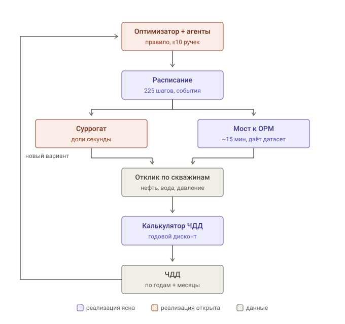

# Концепция решения

Что мы строим, из чего оно состоит и почему именно так — инженерные решения с обоснованиями.
Не заменяет: `10_solution_from_zero.md` (то же самое простыми словами), `08_contracts.md`
(точная форма контрактов), `v2/STATUS.md` (что сделано сейчас). Указатель по всем пяти
вопросам — `README.md`.

Пометки по всему документу: **[факт]** — требование или данные организаторов, **[выбор]** — наше инженерное решение, можно оспорить, **[гипотеза]** — ставка, не проверенная данными.

---

## 1. Система в одном абзаце

Программа, которая решает, как управлять 103 скважинами Model_Z на 225 управляющих шагов (01.2007 → 09.2025, из них 224 с наблюдаемым интервалом — `08_contracts.md` §2.2), чтобы максимизировать ЧДД, и объясняет свои решения человеку. Решения принимаются по предсказаниям нейросетевого суррогата; полная гидродинамическая модель запускается только на финальную проверку. **[факт]**

## 2. Зачем это нужно пользователю

Пользователь — инженер по разработке месторождения. Сегодня проверка одного варианта управления требует прогона ГГДМ (~15 мин на Model_Z [12.08 35:18]). Пространство вариантов — порядка 23 000 управляющих переменных. На практике инженер проверяет единицы сценариев и выбирает лучший из них.

Наша система переносит перебор на суррогат, где вариант считается за доли секунды, и проверяет ГГДМ только финалистов.

---

## 2а. Схема потока данных



Схема читается по кругу: оптимизатор порождает расписание, расписание оценивается, получается ЧДД, оптимизатор пробует следующий вариант. Показывает архитектурные границы, а не актуальный статус задач — текущий прогресс живёт только в `v2/STATUS.md`. Значение цветов в исходной схеме:

| Цвет | Значение |
|---|---|
| фиолетовый | реализация была определена на момент построения схемы |
| коралловый | на момент построения был зафиксирован контракт, но не реализация |
| серый | данные, ходящие между блоками |

После построения схемы оптимизатор выбран и реализован как CMA-ES. На схеме сознательно нет двух вещей: интерфейс (он сбоку, читает расписание и ЧДД, ничего не вычисляет) и генератор датасета (не отдельный блок, а режим работы моста).

## 3. Контур работы

```
Вход:  состояние месторождения + ограничения и возмущения
       («в 2010 дефицит воды на КНС; скважины 12, 40 в ремонте; добычу не терять»)
   ↓
1. Суррогат           предсказывает отклик на вариант управления, доли секунды
2. МАС + оптимизатор  перебирает десятки тысяч вариантов на суррогате
3. Проверка           top-k прогоняются на настоящей ГГДМ
   ↓
Выход: wells_schedule.inc + значение ЧДД + объяснение решений
```

**Два режима работы — их нельзя путать.** Требование «без постоянного запуска полной ГГДМ» относится к режиму работы системы, а не к разработке.

| | Прогоны ГГДМ |
|---|---|
| Разработка (генерация датасета, калибровка суррогата) | сколько нужно |
| Работа системы (демо, валидация) | только суррогат; ГГДМ — финальная проверка **[факт: Онб.9]** |

---

## 4. Состав

| Блок | Контракт | ИИ |
|---|---|---|
| **Экономика** | выгрузка симулятора → ЧДД + разложение по годам | нет |
| **Мост к симулятору** | расписание ↔ `.inc`, запуск tNavigator, выгрузка в dataframe | нет |
| **Генератор данных** | стратегия возмущений → N прогонов → датасет | нет |
| **Суррогат** | управление → дебиты, давления по скважинам-месяцам | да |
| **МАС + оптимизатор** | состояние + ограничения → управляющие решения | да |
| **UI** | сцена месторождения, шаги, объяснения | нет |

Блоки 1–3 не содержат ML, но без них не работает ничего, и они дают первое число — ЧДД базового сценария. UI стартует с первой недели, не с последней.

---

## 5. Ключевые инженерные решения

### 5.1 Суррогат предсказывает дебиты, а не ЧДД **[выбор]**

```
суррогат:  управление → отклик по скважинам-месяцам
слой ЧДД:  точная реализация Методики поверх прогноза
```

Почему так:
- экономика детерминирована и проверяема — угадывать её нейросетью незачем;
- ошибка раскладывается на «ошибку физики» + «точную экономику», диагностируется;
- целевой тензор скважинного уровня, а не полнополевого → **полнополевые суррогаты (FNO, U-Net, 3D CNN) не нужны**, требования к объёму обучающих данных резко падают.

Альтернатива, которую отвергаем: прямая модель `управление → NPV`. Быстрее и дифференцируема, но теряет интерпретируемость динамики и хуже защищается по критерию «качество суррогатной модели».

Подробности и разбор Методики — `04_models.md` §4–5.

### 5.1.1 Три целевые величины, а не дебит нефти напрямую **[выбор]**

Дебит нефти не предсказываем — он произведение двух вещей с разным поведением:

```
q_нефти = q_жидкости × (1 − обводнённость)
```

Учим раздельно:

| Величина | Почему отдельно |
|---|---|
| **Факт добычи** | `LRAT` в деке — цель, а не факт. Скважина отдаёт `min(цель, что может при BHP ≥ 50 бар)`. Достижимость — не отдельный канал, а `факт/цель`, производная от предсказанного факта и уставки расписания (`08_contracts.md` §5.1, исправлено 14.08: булев канал не даёт фактического объёма, без которого не считается ЧДД) |
| **Обводнённость** | Медленная, почти монотонная как правило, а не как жёсткий инвариант. Учится устойчиво. **Отдельная целевая метрика качества** |
| **Приёмистость** | Аналогично добыче: факт против цели по закачке |

Причины:
- обводнённость — это память пласта, её траектория гладкая и предсказуемая; дебит нефти скачет от режима и от обводнённости сразу, и модель не различает, какая причина сработала;
- каждая величина проверяема физически по отдельности — обводнённость не может падать при росте закачки, а это ровно та проверка правдоподобности, которой требует лекция [Лек.38];
- **обводнённость и есть источник денег**: вода штрафуется дважды, за подъём жидкости и за обратную закачку [12.08 42:57]. Величина, делающая ЧДД, обязана иметь собственную метрику, а не получаться побочным продуктом.

**Ловушка, которую это обходит.** Обучение «управление → дебит» в лоб даёт модель, выучившую тождество `дебит ≈ целевой LRAT`, потому что в базовом сценарии режимы в основном достижимы. MAE будет отличный, а оптимизатор поверх скажет «поднять LRAT везде» и на настоящей ГГДМ обвалит давление. Суррогат обязан моделировать **недостижимость цели**.

### 5.1.2 Накопленные признаки обязательны **[выбор]**

Отклик скважины зависит не от текущего режима, а от того, сколько через неё уже прошло. Скважина в начале жизни и она же после 15 лет заводнения на том же режиме ведут себя противоположно.

Поэтому в признаках накопления — но **только целевые**, выводимые из расписания: накопленный целевой отбор, накопленная целевая закачка по окружению, число событий. Без них модель не отличает раннюю стадию от поздней и усредняет.

Фактические накопления на входе недоступны: без прокрутки они и есть то, что предсказывается (§5.1.4). Обоснование выбора и его следствия — `08_contracts.md` §5.3.

Это же делает задачу почти марковской — состояние становится достаточным, всю историю тащить не нужно. **С переходом на целевые накопления утверждение ослабевает:** состояние сжимается хуже, окно по истории управления может понадобиться длиннее. **[гипотеза]**

### 5.1.3 Связность измеряем, а не моделируем **[решение, принято 12.08]**

Ключевое решение по суррогату. **Матрица межскважинного влияния — входной признак модели, а не её выход.**

Механика: возмущаем нагнетательные ортогональным планом (Плакетта-Бермана) — половина на повышенный режим, половина на пониженный по матрице плана. Для каждой добывающей регрессия отклика на столбцы плана даёт чувствительность к каждой нагнетательной. План разделяет **главные линейные эффекты** за число прогонов порядка числа скважин, против того же числа прогонов при переборе по одной и с худшим отношением сигнал/шум. Взаимодействия и нелинейности при этом алиасируются в оценки — это цена, а не дефект реализации.

**Фонд нагнетательных зависит от даты.** На 01.01.2007 их 27, 41 набирается только к 2022 (`04_models.md` §8). Поэтому λ измеряется по окнам: ширина плана — свойство окна, а не константа, и матрица несёт временную область применимости (`08_contracts.md` §8.1.1). Прежняя формулировка «41 нагнетательная за ~48 прогонов» относилась к фонду, которого в начале управления не существует.

Отклик считаем **не по мгновенному дебиту, а по накопленной добыче в окне после воздействия, с перебором лага** — лаг отклика заказчик выделил особо [12.08 20:26].

Дальше соседи агрегируются с весами по **измеренной** λ, а не по расстоянию.

**Почему не CRM как основа.** CRM создан для промысла, где есть только шумная история и нельзя поставить эксперимент. У нас симулятор свой, бесплатный, без квот — основание для CRM отпадает. Плюс CRM предсказывает жидкость, а трудность и деньги сидят в обводнённости, которую он не описывает; «нейросеть на остаток» получала бы основную часть задачи под чужой вывеской.

**Почему не обучаемые эмбеддинги с вниманием.** Это механизм *выучить* связность. Мы её измеряем. Взвешенная агрегация по измеренной λ делает ту же работу на порядок меньшими данными и не упирается в возражение «веса внимания ≠ причинное влияние», которое лекция подчёркивает отдельно [Лек.29]. Возвращаемся к ним, только если измеренная λ окажется неустойчивой между партиями прогонов или остаток модели останется большим.

**Что берём из CRM.** Только идею материального баланса, не уравнение: закачанная вода не может дойти до соседей в объёме больше закачанного. **Баланс встраиваем в конструкцию суррогата** — ограничение на выходе плюс штраф в обучении, а не проверка постфактум. Причина прагматичная: нефтяника, который заметит выдуманную воду глазами, в команде нет, а оптимизатор ищет дыры целенаправленно.

**На саму λ ограничение `Σ ≤ 1` не накладывается.** Это коэффициенты чувствительности с размерностью «прирост добычи на единицу прироста закачки», а не безразмерные доли аллокации CRM. Требовать от них суммы не больше единицы — арифметически бессмысленно (`08_contracts.md` §8.2).

**CRM остаётся базовой линией.** День работы. Любая модель обязана бить его по ранговой корреляции ЧДД, иначе отвергается. Он же запасной вариант, если прямая модель поплывёт.

### 5.1.4 Форма суррогата во времени **[решено 12.08: траектория целиком]**

Организаторы подтвердили разомкнутый режим: команда сдаёт полное расписание на весь горизонт, выполняется **один** расчёт, промежуточное состояние не возвращается (`06_open_questions.md` §2а).

**Суррогат оценивает расписание целиком и выдаёт траекторию целиком.** Прокрутки нет, накопления ошибки нет.

Важное разделение: разомкнута **валидация**, а не наша разработка. Организаторы прямо указывают, что при обучении агента пошаговая обратная связь доступна и ЧДД считается на каждый шаг и накопленно. Агент, обученный пошагово и однократно прокрученный для выдачи полного плана, полностью легитимен.

**Последствия, вышедшие за рамки суррогата:**

- **MPC теряет смысл как продуктовая фича.** Перепланирования при проверке не будет — адаптироваться не к чему. Как внутренний приём построения плана остаётся, но продавать его как реакцию в реальном времени нельзя.
- **«Устойчивость к возмущениям» [Онб.10] читается иначе.** Возмущения даются заранее, в описании кейса, а не подкидываются посреди прогона. Устойчивость = план не разваливается при заданных ограничениях.
- **Устойчивый оптимум (§5.2.1) стал несущим.** Ошибка суррогата уходит до конца горизонта без единого шанса на исправление. Это уже не страховка от разницы симуляторов, а условие качества результата вообще.
- **Калькулятор ЧДД обязан выдавать и пошаговое, и накопленное значение** — требование организаторов и одновременно сигнал вознаграждения при пошаговом обучении.

### 5.2 Суррогат оптимизируем на ранжирование, не на MAE **[выбор]**

Оптимизатор потребляет только сравнение «вариант А лучше Б». Абсолютное значение ЧДД берётся с настоящей ГГДМ на финальном прогоне — там, где оно единственно и требуется.

Ранжирующая постановка переживает систематическое смещение: константа, одинаково сдвигающая все сценарии, порядок не меняет. Из N сценариев получается порядка N²/2 обучающих пар, но **независимой информации в них не N²/2** — пары строятся из тех же N прогонов и сильно зависимы. Пары дают более информативный сигнал на прогон, а не квадратичный рост выборки.

Поэтому одной ранговой корреляции мало. Сдаваемый набор метрик: ранговая корреляция по ЧДД, **precision@k и regret на top-k** (оптимизатору важен именно верх списка, а не весь порядок), отдельная метрика по обводнённости, ошибка по траекториям и доля предсказанных нарушений. MAE по дебитам в этот набор не входит как целевая величина.

### 5.2.1 Стратегия против расхождения ЧДД **[решение 12.08, пересмотрено 15.08]**

> **Пересмотр 15.08.** Раздел писался, когда допустимое расхождение было неизвестно («не катастрофический» [10.08 27:24]), а дек был tNavigator-специфичным. Оба основания изменились:
>
> - регламент 13.08: *«погрешность в пару процентов, обусловленная разницей симуляторов, заложена в допуск и нарушением не считается»* [канал, сообщение 36];
> - Model_Z пересобрана 15.08 и *«дополнительно адаптирована под внешний симулятор — чтобы у всех команд были равные шансы независимо от того, каким симулятором вы считаете»* [канал, сообщение 41].
>
> Организаторы признали разницу симуляторов ожидаемой и приняли её на себя. Риск не исчез, но перестал быть неизвестным по величине. Ниже: ход 1 понижен, ход 2 сохранён и усилен, ход 3 закрыт. Разбор — `06_open_questions.md` §0.1–0.2.

Считаем на OPM Flow, организаторы пересчитывают на своём симуляторе. Правило дисквалификации остаётся [Онб.14], но с конечным допуском. Разные численные схемы дадут разные числа.

**Бюджет допуска один на две ошибки сразу.** «Пара процентов» покрывает расхождение симуляторов *и* любую нашу ошибку в реализации Методики. Вторая обходится дороже: одна лишняя замена ЭЦН на дорогом типоразмере — миллионы рублей, и списать её на численную схему нельзя. Поэтому после 13.08 приоритет сместился с «измерить расхождение симуляторов» на **«сойтись с эталонным расчётчиком организаторов»** (`08_contracts.md` §3.5).

**Риск локализован в одном числе**, которое заявляем в конце. Расписание, суррогат, агенты и UI от выбора симулятора не зависят; какое расписание лучше — тоже почти не зависит, поскольку оба симулятора решают одну физику на одной сетке и направление эффектов совпадает.

Три хода, из них два не требуют ответа организаторов:

**1. Измерить величину расхождения, не имея tNavigator.** ~~OPM Flow и MRST — независимые реализации, обе названы организаторами. Прогоняем одно расписание через оба, сравниваем ЧДД.~~ **ПОНИЖЕН 15.08 до необязательного.** Ход измерял величину, у которой теперь есть заявленный организаторами масштаб («пара процентов») и которую организаторы приняли на себя, пересобрав дек под внешний расчёт. Тратить неделю на вторую конвертацию ради подтверждения чужого допуска — плохой размен на четырёхнедельном спринте.

Прежний разбор сохраняется на случай, если новый дек окажется не таким переносимым, как обещано: совпадение OPM и MRST — это согласие двух реализаций между собой, а не валидация против проверяющего симулятора, обе могут одинаково расходиться с tNavigator. Полезен только асимметричный вывод: **расхождение доказывает наличие проблемы, совпадение её отсутствия не доказывает.** И расхождение бьёт не только по финальному числу — оно меняет λ, датасет, ранжирование кандидатов и, через них, найденную политику.

> **Цена хода была честная:** MRST упирался в ту же несовместимость `WELLTRACK`/`COMPDATMD`, что и OPM, конвертировать пришлось бы дважды. Если новый дек стандартный (`04_models.md` §1, проверяется одним `grep`), цена падает и ход можно вернуть — но уже как проверку качества, а не как страховку от дисквалификации.

**2. Выбирать устойчивый оптимум, а не острый.** Оптимум на узком пике: малое расхождение симуляторов сталкивает с него, заявленное число разъезжается с проверочным. Оптимум на плато: расхождение почти не двигает результат. **Устойчивость входит в задачу оптимизатора как ограничение, не как штраф** (уточнено 13.08, см. §13.3, `08_contracts.md` §13.3): штраф добавил бы одиннадцатую подгоняемую ручку сверх лимита в 10. Совпадает с отдельно оцениваемым критерием устойчивости к возмущениям [Онб.10].

> **ЗАКРЫТО 13.08.** Метрика — regret по батарее сценариев `Constraints` относительно сценарного бейзлайна, в форме ограничения (§13, `08_contracts.md` §13.1–§13.3). Кандидаты «разброс ЧДД при малых возмущениях расписания» и «ширина плато» отклонены не потому, что у θ нет острых пиков — пороги и гистерезис делают ЧДД по θ кусочно-постоянным, разрыв возможен и при одном параметре (§6, исправление ниже). Отклонены потому, что тестовый кейс приходит именно в терминах условий, а не θ (§13.1): возмущать нужно ось, на которой реально будет проверка, а не ось поиска. Разбор — §8 п.3 этого документа.

**3. ~~Спросить организаторов~~ — ЗАКРЫТО 13.08.** Вопрос был: как учитывается расхождение, если считаем на OPM, а проверка на tNavigator. Ответ дан регламентом: погрешность в пару процентов от разницы симуляторов заложена в допуск [канал, сообщение 36]. Незакрытой осталась только точная арифметика допуска — от какой величины и в какую сторону считаются эти проценты (`06_open_questions.md` §3 п.3).

**4. Сойтись с эталонным расчётчиком организаторов — новый ход, теперь главный.** `CHDD_PYTHON.zip` считает ЧДД «по той же методике, что применяется при оценке» [канал, сообщение 35]. Расхождение с ним — не спор, а наш дефект: проверяющая сторона считает именно этим кодом. Контракт приёмки — `08_contracts.md` §3.5.

### 5.3 Данные генерируем сами **[факт]**

Датасета нет. Берём базовое расписание, возмущаем по LHS, прогоняем ГГДМ, записываем. Модель нужна **как генератор датасета, а не как вход** — прямое указание заказчика [12.08 28:16, 28:38]: сетку модели и кубы кормить нейросети неправильно.

Число доступных прогонов — параметр, определяющий, какая архитектура нам вообще доступна. Замерять до выбора архитектуры, а не после.

---

## 6. Мультиагентная часть

23 000 управляющих переменных не берутся одним оптимизатором. Решать по одной скважине тоже нельзя: скважины связаны через пласт, а «агент на каждую скважину» организаторы прямо назвали обречённым [10.08 14:22], и лекция объясняет почему — нестационарность, credit assignment, ленивый агент [Лек.47].

Три уровня:

| Уровень | Ответственность |
|---|---|
| **Менеджер месторождения** | общие лимиты: доступная вода, целевая компенсация по участкам, квоты |
| **Агенты участков** | оптимизация внутри выданного лимита на своей группе скважин |
| **Исполнители-скважины** | режим, вкл/выкл, соблюдение физических ограничений |

### Нарезка на участки **[выбор]**

Группы берутся **не по географии, а из измеренной матрицы влияния λ** (§5.1.3). Алгоритм нарезки при этом не выбран: `Groups = f(λ)` — название задачи, а не спецификация, и до измерения λ остаётся гипотезой (`08_contracts.md` §6.2).

Почему:
- отвечает на центральный тезис заказчика: «пространственная близость не означает гидродинамическую связь» [12.08 27:13], а «качественная оценка межскважинных связей» названа одним из двух важнейших компонентов [12.08 25:27];
- λ измерена планом эксперимента, а не выведена моделью — на защите это утверждение без оговорок;
- новое месторождение → замерили λ → иерархия перестроилась. Это и есть оцениваемая масштабируемость;
- в UI рисуется одной картинкой.

**Изменение позиции (12.08):** ранее здесь стояла гипотеза о нарезке из весов внимания обученного суррогата. Отменена — измеренная λ доступна раньше, стоит дешевле и защищается без оговорки «внимание не равно влияние».

**Что проверить:** устойчивость λ между независимыми партиями прогонов, и её дрейф во времени — фронт за 18 лет уходит далеко, связность ранних лет может не описывать поздние. Запасной вариант — группировка по проводимости через сетку, считается офлайн из `Model_Z_grid.inc` без единого прогона.

### Параметризация: оптимизируем правило, а не вектор **[решение, принято 12.08]**

Расписание — это 103 скважины × 225 месяцев ≈ **23 000 чисел**. В лоб не берётся: случайный поиск в таком пространстве не находит ничего, эволюционные методы ломаются уже на сотнях измерений, а градиент не работает, потому что целевая функция кусочно-постоянна из-за порогов ЭЦН и дискретных событий.

Параметризация — чем мы описываем расписание вместо этих 23 000 чисел. Размен: мало ручек — быстрый поиск, но не всякое расписание выразимо; много ручек — выразимо всё, но искать невозможно.

**Оптимизируем не расписание, а правило, которое его порождает.**

Решающий аргумент: **тестовый кейс мы не видели.** Вектор, вылизанный под базовый сценарий, привязан к конкретным датам и режимам и на новом кейсе бесполезен. Правило смотрит на состояние и решает — в новом кейсе состояние просто другое. Это ровно то, чего требуют организаторы: агент должен понимать физику, а не запоминать данные [12.08 23:38]. Правило — понимание, вектор — память.

> **Уточнение 15.08.** Регламент отбора говорит: валидационный кейс — это **ограничения плюс история разработки**, а модель остаётся Model Z, *«перенастраивать систему под новое месторождение не потребуется»* [канал, сообщение 36]. Аргумент от этого не рушится, но меняет опору: правило переносится не на другой фонд и другую сетку, а на **другие ограничения и другую предысторию**. Ось скважин и геометрия те же — значит вектор не так безнадёжен, как выглядело, и честная формулировка звучит так: правило выигрывает потому, что ограничения кейса нам неизвестны, а не потому, что месторождение будет другим. На защите «переносится на новое месторождение» — необоснованное обещание, проверить его не на чем.

Два довеска: объяснимость получается даром (не нужен отдельный слой интерпретации) и масштабируемость (правило не знает, сколько на месторождении скважин).

**Чего в этот список записывать нельзя — гладкости.** Формулировка «у правила с ≤10 параметрами нет острых пиков по построению» неверна: пороги R0 и R3, гистерезис, квантование уставок и границы типоразмеров ЭЦН делают ЧДД кусочно-постоянным по θ, и разрыв возможен при одном параметре. Мало ручек — это малая размерность поиска, а не гладкий ландшафт. Устойчивость получается не даром и меряется отдельно (`08_contracts.md` §13).

**Потолок честный:** правило не выразит всё, что выразит свободный вектор. Поэтому гибрид — правило строит основу, сверху небольшая поправка на десяток скважин, где сосредоточены деньги.

Иерархия агентов (выше) **и есть эта параметризация**: менеджер задаёт лимиты по группам — грубый уровень, агенты участков распределяют внутри — точный.

### Набор правил **[решение, принято 12.08]**

Три слоя, **не более 10 подгоняемых параметров**. Критерий допуска правила в набор: формулируется одной фразой на языке промысла. Не формулируется — значит это замаскированный подгоночный коэффициент.

#### Слой 1 — выведено из экономики, не подгоняется

**R0. Порог рентабельности.** *«Держим скважину, пока она отбивает своё содержание.»*

```
q · 365 · [(1−W) · ρ_т · 8360 − 100]  >  1 000 000 руб/год
       ρ_т = 0.9131 т/м³, плотность в тоннах на кубометр, не в кг/м³
```

Порог зависит от дебита: 91.5% при 5 м³/сут, 96.9% при 20, 98.3% при 100 (таблица и вывод — `04_models.md` §4). Параметров ноль, это арифметика из Методики. Единицы плотности обязательны к проверке тестом: ошибка на 1000 даёт правило, по которому рентабельна любая скважина.

#### Слой 2 — ядро политики

**R1. Распределение закачки по предельной ценности.** *«Вода течёт к тем скважинам, где она превращается в нефть, а не в воду.»*

```
MV_i = Σ_j λ_ij · (1 − W_j) · 8360 · ρ_т  −  30            руб на м³ закачки
```

где `λ_ij` — измеренная чувствительность: прирост накопленной **жидкости** скважины `j` в м³ на 1 м³ закачки в `i` (§5.1.3); `(1 − W_j)` переводит жидкость в нефть; `8360 · ρ_т` — маржа нефти в руб на м³ жидкости; `30` — OPEX закачки, руб/м³.

**Размерность обязана сходиться, и от неё зависит смысл `(1 − W_j)`.** Если λ измерена по накопленной нефти, множитель `(1 − W_j)` штрафует воду второй раз и правило врёт в пользу промытых зон. Поэтому контракт фиксирует: λ измеряется по жидкости, обводнённость входит отдельным множителем. Это выбор, а не единственный вариант, но смешивать две трактовки нельзя.

Чего формула **не** учитывает: дисконт (закачка сегодня даёт нефть через лаг), дискретные затраты и изменение обводнённости от самой закачки. Полная предельная ценность включала бы их; текущая форма — приближение первого порядка, и на защите называть её надо так.

Одно правило заменяет несколько и само душит закачку в промытые зоны: там `W_j` высокая и предельная ценность отрицательна. Это посчитанная версия «неэффективной циркуляции» из диагностики Аленькина (`02_domain.md` §9). Порог остановки при этом выпадает как следствие: скважина, за которую никто не платит закачкой, глушится сама.

Параметр: 1 (лаг отклика, если не берём измеренный).

#### Слой 3 — подгоняемое, 9 параметров

| | Правило | Формулировка | Пар. |
|---|---|---|---|
| **R2** | Уровень отбора | «Разгоняем чистые скважины, душим обводнённые» | 2 |
| **R3** | Гистерезис | «Закрываем после N месяцев убытка, открываем только с запасом» | 2 |
| **R4** | Порог ЭЦН | «Не пересекаем границу типоразмера, если разгон не окупает насос» | 1 |
| **R5** | Компенсация | «Держим компенсацию участка в коридоре» | 2 |
| **R6** | Перевод под закачку | «Переводим, когда как нагнетательная она дороже, чем как добывающая» | 1 |
| **R7** | Циклика | «Периодически останавливаем высокообводнённые, чтобы вовлечь защемлённое» | 2 |

**R2** держит главное напряжение задачи: дисконт 10% на 18 лет тянет добычу в ранние годы, а форсирование ускоряет прорыв воды и убивает поздние.

**R3** — не физика, а защита от **дребезга**. Скважина у порога иначе щёлкает каждый месяц по 1 млн руб за событие. Отдельно опасна связка «остановка → падение компенсации → срабатывание R1 → возврат рентабельности → открытие»: без гистерезиса и минимального времени удержания это автоколебания на всём фонде.

**R4** — храповик ЭЦН. В диапазоне дебитов Model_Z понижение типоразмера недостижимо в принципе, поэтому любой временный разгон фиксирует дорогой насос навсегда.

**R7 добавлять последним.** Аленькин рекомендует циклику прямо [12.08 56:33], но остановка и запуск стоят по 1 млн: двадцать циклов на скважину — 40 млн. Включать, только если данные подтвердят выгоду.

#### Дисциплина против разрастания

Отключаем правило, гоняем, смотрим падение ЧДД. Не упало — выкидываем. Без этого набор разрастётся до тридцати порогов, где никто не отличит осмысленное поведение от подогнанного — а команде без нефтяника это единственный способ ловить чушь.

### Где LLM, а где нет **[факт: наличие; выбор: роль]**

> **Уточнение статуса 15.08.** ТЗ хакатона §3.1: *«Решение должно содержать слой интерпретируемости/агентов, имеющих в ядре языковую (мультимодальную) модель.»* То есть языковая модель в системе — **требование организаторов**, а не наш выбор. Выбором остаётся её роль: мы даём ей ровно две работы и не пускаем в числовую оптимизацию.

LLM **не** ведёт числовую оптимизацию — медленнее, хуже, невоспроизводимо. LLM делает две вещи:
- **диагностика на языке промысла** — читает состояние, называет проблему («компенсация 1.4, прорыв по 42-й, канал на нагнетательную 49»). Правила берём из `02_domain.md` §9, это готовый список паттернов от Аленькина;
- **объяснение решений** — слой интерпретируемости, который жюри валидирует человеком [10.08 10:04].

---

## 7. Что даёт отличие от других команд

**[гипотеза]** — предположения о том, что будут делать остальные, не подтверждены.

| | Ожидаемое типовое решение | Наше |
|---|---|---|
| Экономика | ~~считают ЧДД приблизительно, расходятся с эталоном~~ **отличия больше нет:** эталонный расчётчик выдан всем 13.08 | реализация Методики, сходящаяся с эталоном; преимущество не в точности, а в том, что ЧДД разложен по скважинам и годам и потому используется как сигнал, а не только как финальное число (`08_contracts.md` §3.3) |
| Связность скважин | геометрическая близость или выученная моделью | **измерена ортогональным планом эксперимента** |
| Нарезка агентов | по кустам или по одной скважине | из измеренной матрицы влияния |
| Что оптимизируем | вектор расписания под базовый сценарий | правило, переносимое на невиданный кейс |
| Порог остановки скважины | плоский, «глушим всё выше 90%» | зависящий от дебита, выведенный из Методики |
| Дребезг режимов и храповик ЭЦН | не учитываются | гистерезис и порог окупаемости в самих правилах. **Величину проверили 15.08 и она скромнее, чем мы писали:** в просчитанном сценарии Аленькина CAPEX на насосы 63 млн против 4 894 млн OPEX — 1.3% расходов (`04_models.md` §4.1). Формулировку «тихо жгут деньги» с защиты убрать |
| Метрика суррогата | MAE по дебитам | ранговая корреляция по ЧДД + отдельная метрика по обводнённости |
| Самооценка суррогата | нет | детектор выхода за обучающий диапазон — организаторы назвали его критерием масштабируемости [10.08 35:40], но он не добавляет очков к ЧДД, поэтому его почти никто не построит |

---

## 8. Открытые развилки

1. **Семейство обученной модели.** Варианты и trade-off — `05_solution_space.md` слой 1. Решаем после замера разброса ЧДД на разведочных прогонах.
2. **Оптимизатор.** Там же, слой 2. Режим разомкнутый, поэтому MPC как продуктовая фича отпал; остаются эволюционные методы, градиент по дифференцируемому суррогату и пошагово обученная политика с однократной прокруткой.
3. ~~**Как измерять хрупкость оптимума.**~~ **ЗАКРЫТО 13.08, уточнено в тот же день.** Величин две, и они разные: адаптивность политики меряется батареей сценариев `Constraints` через regret относительно сценарного бейзлайна, хрупкость к ошибке суррогата — внешним циклом верификации. Контракт — `08_contracts.md` §13. Открытыми остаются порог допустимого regret и цена сценарных бейзлайнов в прогонах.
4. ~~**Дрейф λ во времени.**~~ **ЗАКРЫТО 13.08 формой контракта.** λ измеряется по окнам, каждая матрица несёт область применимости (`08_contracts.md` §8.1.1) — этого требует уже сам факт роста фонда нагнетательных с 27 до 41. Дрейф становится замеряемой разностью между окнами, а не открытым вопросом. Не решено, сколько окон нужно.
5. **Алгоритм нарезки на участки.** `Groups = f(λ)` зафиксирован по форме артефакта, но не по способу построения: направленность, число групп, перекрытия, судьба переведённых скважин. Решается на данных задачи 28.

---

## 9. Журнал изменений решений

| Дата | Было | Стало | Причина |
|---|---|---|---|
| 12.08 | Нарезка агентов из весов внимания суррогата | Из измеренной ортогональным планом λ | Внимание ≠ причинное влияние [Лек.29]; измерение доступно раньше и дешевле |
| 12.08 | CRM как физическая основа + нейросеть на остаток | CRM как базовая линия и источник ограничения материального баланса | CRM решает проблему нехватки данных, которой у нас нет — симулятор свой и бесплатный; CRM предсказывает жидкость, а деньги в обводнённости |
| 12.08 | Симулятор ждём от организаторов | OPM Flow как основной, ставим сами | Организаторы его не дают; плюс Docker-образ не может зависеть от коммерческой лицензии [Онб.14] |
| 12.08 | Форма суррогата во времени открыта; MPC как вероятный оптимизатор | Траектория целиком; MPC снят как продуктовая фича | Организаторы подтвердили разомкнутую валидацию: один расчёт по полному расписанию, обратной связи нет |
| 12.08 | Оптимизируем вектор расписания | Оптимизируем правило, порождающее расписание; ≤10 подгоняемых параметров | Тестовый кейс не виден: правило переносится, вектор нет. Плюс объяснимость и устойчивость оптимума получаются по построению |
| 13.08 | Контрактов данных нет | Расписание, калькулятор ЧДД, мост к симулятору, суррогат зафиксированы в `08_contracts.md` | Работа режется на параллельные куски только по зафиксированным границам; контракт замораживается раньше, чем выбрана реализация |
| 13.08 | Форма расписания не определена | Канонический разреженный лог событий, горизонт 225 шагов, история — неизменяемый префикс, `initial = replay(prefix)` | Уставка меняется в 0.9% шаго-скважин (`04_models.md` §8.2); число событий совпадает со счётчиком затрат по 1.0 млн; round-trip истории даёт оракул при отсутствии эталона |
| 13.08 | Пошаговое ЧДД не специфицировано | Разложение годового `FCF_m · DF_{year(m)}`, своей месячной ставки нет | Месячный дисконт даёт ЧДД на 4.2% ниже годового и делает перенос добычи внутри года выгодным на 9%, тогда как Методика платит за это ноль |
| 13.08 | Накопленные признаки без уточнения (§5.1.2) | Только целевые накопления, считаются с 1994 | Фактические требуют прокрутки, отменённой в §5.1.4. Побочно: `SurrogateInput` выводится из одного `Schedule`, фичеризатор не ждёт работающего OPM |
| 13.08 | Откуда политика берёт состояние — не определено | Неподвижная точка: политика и суррогат итерируются до совпадения хешей расписания | Правила R0–R5 читают фактическое состояние, а прокрутка отменена в §5.1.4. Итерация сохраняет контракт суррогата целиком, стоит несколько его прогонов и проверяется бесплатно через канонический хеш |
| 13.08 | Сверки контуров с обязательным пакетом сдачи не было | Аудит против `01_track2_spec.md` §4–5; семь пропусков закрыты в `08_contracts.md` §7–11 и §2.5 | Отсутствовали: внешний цикл верификации с областью доверия, измерение λ, конфиг с seed, валидатор режимов, поле давления в выгрузке, генератор датасета как компонент |
| 13.08 | Метрика хрупкости не определена (§8.3); амплитуда возмущения для λ назначена как ±20% | Хрупкость — просадка ЧДД по батарее возмущений `Constraints`, в форме ограничения (`08_contracts.md` §13). Амплитуда λ — протокол замера со свипом и проверкой достижимости (§8.3) | Возмущать θ бессмысленно: у правила с ≤10 параметрами острых пиков нет по построению. Возмущать надо условия — это же и прокси невиданного кейса. По λ: недобор целевой закачки при 300 бар ломает ортогональность плана и роняет все оценки разом |
| 13.08 | Внутри горизонта генерируются только режимы фонда; `COMPDATMD` считался статикой начала дека | `Schedule` из двух слоёв: фиксированные события дека и управляющие. Ось скважин 103 неизменна, недоступность выражается состоянием `NOT_COMMISSIONED` | Повторный парсинг: 25 блоков `COMPDATMD`, `WPIMULT` и ввод 22 скважин лежат **после** 01.01.2007 (`04_models.md` §3). Расписание без этого слоя описывает другое месторождение, и по числу ЧДД это не диагностируется |
| 13.08 | `len(events)` — счётчик событийных затрат; события берутся только из `Schedule` | Автомат состояний по факту: действующая = `WLPR > 0` или `WWIR > 0`, платят переходы. Перевод — `5.0 млн + ЭЦН` без остановки, ввод скважины не запуск, `LRAT = 0` — остановка со стоимостью | Буква Методики: затраты определяются сравнением состояния с предыдущим шагом. Смена уставки бесплатна, а расписание и факт расходятся — считать надо по факту, как считает проверяющая сторона |
| 13.08 | Шкалы времени сведены как `deck_index = 146 + control_index`, горизонт «225 месячных шагов» | 225 управляющих дат при 224 замкнутых интервалах; `volume[k] = cumulative[147+k] − cumulative[146+k]`, последний шаг — `terminal_state` без интервала | Индекс сам по себе не задавал, начало это интервала или конец, а после 01.09.2025 в деке нет следующей `DATES`. Обе неопределённости дают правдоподобный, но неверный ЧДД |
| 13.08 | Достижимость цели — канал суррогата; `script_1.py` — готовый контракт выгрузки | Каналы фактические и непрерывные (`liquid_rate`, `injection_rate`, обводнённость, `bhp`), достижимость производна; приросты считаются внутри скважины | Булев флаг не даёт фактического дебита, без которого не считается ни нефть, ни ЭЦН, ни ЧДД. Глобальный `.diff().shift(-1)` в скрипте трека 1 переносит накопленное через границу скважин |
| 13.08 | План эксперимента на 41 нагнетательную; `Σλ ≤ 1`; `θ → скаляр` | λ оконная (27 активных на t0), регрессия на фактические `ΔWWIR` с проверкой ранга; ограничение суммы снято как неприменимое к размерным коэффициентам; оптимизатор возвращает структуру с `feasible` и нарушениями по сценариям | 41 — фонд конца горизонта, в раннем окне его нет. `Σ ≤ 1` относится к долям аллокации, а не к чувствительностям. Скаляр вынуждал свернуть ограничение устойчивости в штраф, запрещённый §13.3 |
| 13.08 | Контракта интерфейса нет, форма сцены не выбрана | `08_contracts.md` §12: главный вид — граф влияния λ, карта 2D вторым видом, объёмной сцены нет; взаимодействие перечислено поимённо | Вскрытие 7.4 м против смещения ствола 349 м — вертикаль занята нерабочей частью (`04_models.md` §1.1). Объёмный куб обещает моделирование пласта, от которого отказались в §5.1. Побочно: ЧДД раскладывается по скважинам точно, без произвольного распределения затрат |
| 14.08 | Отклик — один тензор `371×103×каналы`; один `Emitter` на lossless-round-trip и на OPM; финал цикла верификации — переоценка суррогатом; хрупкость измерена, ЭЦН по «22 скважинам»; конверсия перфораций разовая | `StateAtDate[371]` (мгновенные) и `IntervalResponse[224]` (объёмы) — раздельные типы; три эмиттера (`LosslessTNavEmitter`, `OpmDeckEmitter`, `SubmissionEmitter`); обязательный финальный OPM-прогон с тождествами хешей (§10.5) как единственный источник заявленного числа; `allow_conversion_retiming = false` по умолчанию; ЭЦН только у 14 из 22 вводимых (producer-first); `OpmDeckEmitter` конвертирует `COMPTRAJ` на каждой из 25 внутригоризонтных дат | Второй внешний review (14.08): один тензор с общим индексом воспроизводил противоречие между «снять терминальную строку» (forward align) и `volume[k]=cum[147+k]-cum[146+k]` (значение на строке `147+k`) — два типа делают перепутывание осей невозможным на уровне типов. Один `Emitter` не может быть одновременно оракулом round-trip и входом в OPM — у них разный синтаксис (`COMPDATMD` против `COMPTRAJ`) и разные требования к точности. Переоценка суррогатом — это выбор кандидата внутри цикла, не сдача: только реальный OPM-прогон защищает от дисквалификации [Онб.14]. `08_contracts.md` §6.6 всё ещё утверждал «метрики хрупкости нет» — живое противоречие с §13, не только в историческом журнале |
| 15.08 | Допустимое расхождение ЧДД неизвестно («не катастрофическое»); риск разницы симуляторов — высший приоритет; сверка OPM ↔ MRST как страховка от дисквалификации | Допуск «пара процентов, обусловленная разницей симуляторов» [канал, сообщение 36]; риск понижен до управляемого; ход MRST понижен до необязательного (§5.2.1) | Регламент отбора от 13.08 задал допуск количественно и признал разницу симуляторов ожидаемой. Плюс организаторы пересобрали Model_Z «под внешний симулятор» [канал, сообщение 41] — сами убрали основание риска |
| 15.08 | Эталонного расчёта ЧДД нет, приёмка калькулятора — два косвенных оракула (`08_contracts.md` §3.5); экономические неясности требуют запроса организаторам | Главный оракул — расчётчик организаторов `CHDD_PYTHON.zip`; `economics_config` строится из выданных нормативов; косвенные оракулы остаются юнит-тестами; неясности переведены из «спросить» в «прочитать» | Организаторы выложили 13.08 скорректированную методику и эталонный расчётчик «по той же методике, что применяется при оценке» [канал, сообщение 35]. Проверяющая сторона считает этим кодом — расхождение с ним по определению наш дефект |
| 15.08 | Точная реализация Методики — пункт отличия от других команд | Отличие снято: эталон выдан всем. Осталось разложение ЧДД по скважинам и годам как сигнал, а не только финальное число | Честность перед защитой: продавать как преимущество то, что организаторы раздали всем, — способ получить вопрос жюри, на который нечего ответить |
| 15.08 | Замеры по деку и нормативы Методики — подтверждённые факты | Помечены как относящиеся к прежним редакциям, подлежат перепроверке (`04_models.md`, врезка вверху) | Обе исходные редакции заменены организаторами (13.08 методика, 15.08 дек). Числа, на которых стоят контракты и тесты, держатся на файлах, которых больше нет |
| 15.08 | Экономика: `FCF = EBITDA − CAPEX`, перевод под закачку `5.0 млн + ЭЦН`, первичный ЭЦН вводимой скважины в CAPEX, потолка дебита нет | `FCF = EBITDA − Налог_прибыль − CAPEX` с налогом 25% на годовой базе; перевод ровно 5.0 млн в OPEX без ЭЦН; первичное оснащение не начисляется вовсе; жёсткий потолок `LRAT` 500 м³/сут в `validate_static` | Разбор скорректированной Методики и кода эталонного расчётчика (`04_models.md` §4.0). Каждое из четырёх расхождений меняло бы заявленное число, а бюджет допуска — «пара процентов» на всё сразу. **Три из четырёх — правки самой Методики между редакциями** (дифф снят построчно), первичный ЭЦН — наша достройка пробела, стоявшая открытым вопросом |
| 15.08 | Конвертация дека под OPM — работа на неделю, `WELTRAJ`/`COMPTRAJ`, двойная конверсия ради MRST | Конвертация отменена: организаторы пересобрали дек стандартным `COMPDAT`. Задача 2 сведена к сборке дека и проверке чтения | Дифф прежней tNavigator-редакции против новой: `WELLTRACK`, `COMPDATMD`, `LGR`, `COREYWO` — ноль вхождений (`04_models.md` §1.2) |
| 15.08 | Координаты устьев в метрах из `WELLTRACK` — основа карты | Карта в индексах сетки из `WELSPECS`; принадлежность слоям из `K1 K2` в `COMPDAT` | Вместе с `WELLTRACK` из дека ушли траектории и метрические координаты. Взаимное расположение фонда не изменилось, изменилась подпись оси (`08_contracts.md` §12.3) |
| 15.08 | Храповик ЭЦН — пункт отличия, «тихо жжёт деньги» | Правило остаётся, статус источника преимущества снят | В просчитанном сценарии Аленькина насосы дают 63 млн CAPEX против 4 894 млн OPEX (`04_models.md` §4.1). Продавать на защите то, что стоит 1.3% расходов, — способ получить встречный вопрос |
| 15.08 | Языковая модель в системе — наш выбор (§6) | Наличие языковой модели — требование ТЗ §3.1, выбором остаётся её роль | ТЗ: «Решение должно содержать слой интерпретируемости/агентов, имеющих в ядре языковую (мультимодальную) модель» |
| 16.08 | `NOT_COMMISSIONED → ACTIVE` — не запуск, начисления нет (`04_models.md`, таблица переходов) | Ввод скважины внутри горизонта начисляется как запуск, 1.0 млн | Эталонный расчётчик понятия «невведённая скважина» не имеет вовсе: `_build_activity_transitions` сравнивает только `previous_active != active` по факту дебита. На реальном деке это 22 скважины = 22 млн руб недисконтированных. Инвариант §4: считает проверяющая сторона, расхождение с ней — наш дефект по определению. Обнаружено сличением задачи 10, подтверждено чтением кода эталона |
| 16.08 | Бюджет θ: R0–R2 занимают 3, на R3–R7 остаётся 5, а концепция §6 расписывала их на 8 ручек | R3 — 2, R4 — 0, R5 — 2, R6 — 1, R7 — 2 зарезервировано; занято 8 из 10 | Не помещалось. Сэкономлено на R4: CAPEX на насосы — 1.3% расходов (§4.1), а понижение типоразмера в диапазоне Model_Z недостижимо, поэтому порог целиком выводится из каталога ЭЦН и нормативов — подгонять там нечего. R4 стал беспараметрическим |
| 16.08 | Гистерезис R3 — правило поверх R0 | R3 при включении **замещает** R0, а не дополняет | R0 глушит мгновенно по порогу рентабельности, и гистерезису нечего гасить: скважина у порога щёлкает каждый месяц по 1.0 млн за событие. Замещение объявлено данными (`SUPERSEDED_WHEN_ON`), выключение R3 возвращает решение к R0 |
| 16.08 | R7 циклика — правило наравне с остальными | Реализовано, но **выключено по умолчанию и защищено порогом выгоды**; статус — гипотеза, не результат | Карточка требует включать только при подтверждённой данными выгоде, а суррогат не обучен и датасет не намолочен. Двойная защита: флаг выключен, и даже включённое правило не цикликует, пока прирост не превысит `2 × event_cost` плюс упущенную маржу простоя; величина прироста приходит извне и сейчас никем не заполняется — в Trace пишется `NO_CYCLE_UPLIFT_NOT_MEASURED`. На защите формулировать как «реализовано, выключено, ждёт замера». Побочно: θ заполнен ровно под потолок, 10 из 10 |
| 16.08 | Формулировка «найдена неподвижная точка» | Точнее: найденное расписание — неподвижная точка пары **политика ∘ суррогат**, а не политика ∘ физика | Итерация сходится по совпадению канонических хешей расписания при оценщике-суррогате. Что та же точка устойчива на реальной гидродинамике — отдельное утверждение, проверяемое только внешним циклом верификации. Смешивать их на защите нельзя |
| 15.08 | «224 интервала, потому что после 01.09.2025 нет следующей `DATES`»; фильтр отрицательных строк — правило Методики | Число то же, механизм другой: экспортный скрипт организаторов портит по одной строке на границе каждой скважины, 102 строки датой 01.09.2025, и фильтр эталона выбрасывает именно их. `ResponseLoader` обязан воспроизводить фильтр, а не только считать приросты правильно | Арифметика сходится точно с диагностикой эталонного прогона (`04_models.md` §5). Считать последний интервал честно, когда проверяющая сторона его выбрасывает, — расхождение на месяц по каждой скважине при идентичной физике |
| 15.08 | Валидационный кейс — «начальное состояние ГГДМ + невиданные ограничения», объект мог смениться | Кейс = ограничения + история разработки, **модель та же Model Z**; перенастройка под другое месторождение не потребуется [канал, сообщение 36] | Аргумент «оптимизируем правило, а не вектор» (§6) сохраняется, но опирается теперь на смену ограничений и истории, а не на смену объекта. Формулировку на защите надо править: «переносится на новое месторождение» превращается в необоснованное обещание |
| 16.08 | `SummarySpec.keys` одновременно считался колонками эталонного экспорта и буквальными ключами OPM; `WOMT` / `WOMR` запрашивались напрямую | Три части: девять `export_keys`, поддерживаемые `opm_well_keys` с `WMCTL`, `opm_connection_keys = (COPT, COPR)`; масса по подключениям через `PVTNUM` и `DENSITY` | Настоящий Flow 2026.04 падает на `WOMT`; `COPT` / `COPR` и `WMCTL` подтверждены прогоном. 23 скважины вскрывают оба PVT-региона, поэтому одна плотность на скважину даёт систематическую ошибку |
| 20.08 | `contracts.canonical_bytes` — приближение RFC 8785 через `json.dumps` (`45.0` печаталось как `45.0`), строгий JCS жил отдельно в `schedule/canonical.py`; ось `Schedule.meta.wells` контракт объявлял лексикографической, а `schedule/build.py`/`schedule/canonical.py`/`bridge/dataset_plan.py` строили её числовым порядком (`"2"` раньше `"10"`) | Строгий JCS — единственная реализация, перенесена в `contracts/hashing.py`; `schedule/canonical.py` её переиспользует, не дублирует. Ось скважин — лексикографическая везде, канон — `bridge.OpmDeckEmitter.source_wells`. Заодно закрыт дефект задачи 53: `canonical_bytes` больше не падает на enum-ключах словаря (`_key_text`) | §1.6 требовал строгий JCS с самого начала — приближение было отступлением от собственного контракта, а не альтернативой. Ось скважин определяет мост (`OpmDeckEmitter._validate` уже отвергал несовпадение) — переписывать мост дороже и рискованнее, чем два внутренних пакета. Задача G2 (`docs/v2/tasks/integration.md`) |
| 20.08 | Звено А §10.5 обрывалось на первом несовпавшем тождестве и бросало исключение | Все шесть считаются всегда и целиком: `IdentityCheck{name, holds, detail}` на каждое, `SubmissionResult` несёт `identities`, `failed_identities`, `sound` и `npv_methodology`, недоступный пока цепочка не прошла. ЧДД считается и при грязной динамике — заявлять его нельзя, но иначе нарушение динамики неотличимо от ошибки в деньгах. Единственный досрочный обрыв — `validate_static`, за ним прогон OPM ценой 10–20 минут | Попытка сдачи одна [Онб.14]: различать «сломано одно» и «цепочка разошлась целиком» надо до неё, а не после. Подход перенесён из ветки `feat/andrey/62`, закрытой после переноса. Задача G6 |
